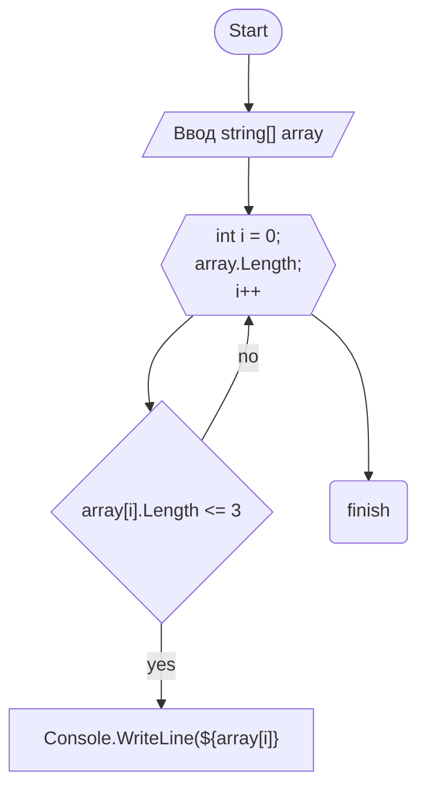

# final_homework

## __Задача__
----

Написать программу, которая из имеющегося массива строк формирует массив из строк, длина которых меньше либо равна 3 символа. Первоначальный массив можно ввести с клавиатуры, либо задать на старте выполнения алгоритма. При решении не рекомендуется пользоваться коллекциями, лучше обойтись исключительно массивами.

## __Блок-схема__
----

`На вход принимаются любые значения, введенные пользователем в консоль через пробел. Далее происходит разбивка строки на элементы, используя метод Split, где разделителем выступает символ пробела (' '). Задается новый массив размера, соответствующего количеству элементов строки. Далее используется метод, в результате которого для каждого элемента текущего массива проводится проверка на соответствие условию "количество символов <= 3". В случае выполнения условия, значение данного элемента массива выводится в консоль в строку. Цикл повторяется до тех пор, пока не будут проверены все элементы массива.`